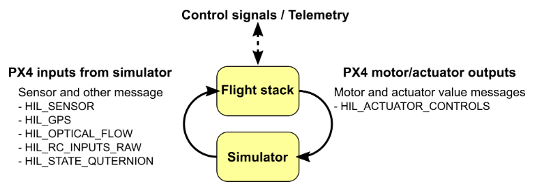

# Defining a Custom Vehicle in PX4-Autopilot

> This document is based on **Release v.1.13.0 of PX4-Autopilot**
> For Different release of PX4-Autopilot, content of this document may be invalid

## Files

|NAME|DIRECTORY|TYPE|
|:-|:-|:-|
||||
|`<DESIRED_NUM>_<MODEL_NAME>`|`PX4-Autopilot/ROMFS/px4fmu_common/init.d-posix/airframes/`|ADD|
|`CMakeLists.txt`|`PX4-Autopilot/ROMFS/px4fmu_common/init.d-posix/airframes/`|MODIFY|
|`<MIXER_NAME>.main.mix`|`PX4-Autopilot/ROMFS/px4fmu_common/mixers/`|ADD|
|`CMakeLists.txt`|`PX4-Autopilot/ROMFS/px4fmu_common/mixers/`|MODIFY|
|`sitl_target.cmake`|`PX4-Autopilot/platforms/posix/cmake/`|MODIFY|
|`CMakeLists.txt`|`PX4-Autopilot/src/lib/mixer/MultirotorMixer/`|MODIFY|
|`<GEOMETRY_NAME>.toml`|`PX4-Autopilot/src/lib/mixer/MultirotorMixer/geometries/`|ADD|

## 1. Overview

 <sub>[[1]](https://docs.px4.io/v1.12/en/simulation/#simulator-mavlink-api)</sub>

- In SITL (Software-In-The-Loop) simulation, PX4 receives sensor states from simulator while sending actuator commands
- This means that the act of '*defining a custom vehicle*' is composed of two parts of tasks:
  - Defining actuator geometries & mixer settings on PX4-Autopilot
  - Defining physical parameters and sensor types & location on simulator (Gazebo or AirSim)
- PX4 defines `airframe` and `mixer` to set a vehicle. Also, build targets have to be set for proper SITL runs

## Defining an airframe geometry

- Airframe geometries are defined in `MultirotorMixer` of `mixer` module located in `src/lib/`
- Geometry defines...
  - `key` value. The value used to call a geometry later on
  - Where rotors are located
  - Which direction rotor rotates
  - Default rotor axis
  - Non-dimentional thrust/drag-torque coefficient 
- Geometry files are defined in `.toml` format as following:

```toml

# Generic Hexacopter in + configuration

[info]
key = "6+"
description = "Generic Hexacopter in + configuration"

[rotor_default]
axis      = [0.0, 0.0, -1.0]
Ct        = 1.0
Cm        = 0.05

[[rotors]]
name      = "front"
position  = [1.0, 0.0, 0.0]
direction = "CW"
...
```

- If you added a new geometry file, you must add it to `CMakeLists.txt` on directory above
- This was a case of adding multirotor geometry. For other types such as helicopter, check other folders in `src/lib/mixer` directory
  - For fixed wing vehcles, you do not need to add a rotor geometry

## Defining a mixer

- For multirotor, reated geometry should be 'called' from mixer files in `ROMFS/px4fmu_common/mixers`
  - In case of fixed-wings, mixer should be defined here using 'Summing Mixer'
- Type of mixers called in `.mix` file are as following:<sub>[[2]](https://docs.px4.io/main/en/concept/mixing.html)</sub>
  - `R`: Multirotor mixer
  - `H`: Helicopter mixer
  - `M`: Summing mixer
  - `Z`: Null mixer
<br/>

- For case of multirotors, simply set a multirotor mixer defined by geomtry
  - Be aware that `.mix` file **must have empty last line** for proper build

```mix
# Hexa X

R: 6x

```

- Again, newly added mixer should be listed in `CMakeLists.txt` which is in the same directory

## Defining a vehicle

- Target vehicle with MAVLINK parameter settings should be created in `ROMFS/px4fmu_common/init.d-posix/airframes/` directory
- Vehicle files have a naming rule of `<DESIRED_NUM>_<NAME>` with no any extension (but in form of shell script)
- These files define PID control gains of vehicles and various MAVLINK parameter values
  - Be aware of proper settings of `MAV_TYPE` and `MIXER`, PID gains
- Example of this file is as following:

```shell

#!/bin/sh
#
# @name Typhoon H480 SITL
#
# @type Hexarotor x
#

. ${R}etc/init.d/rc.mc_defaults

param set-default MAV_TYPE 13

param set-default MC_PITCHRATE_P 0.0800
param set-default MC_PITCHRATE_I 0.0400
param set-default MC_PITCHRATE_D 0.0010
param set-default MC_PITCH_P 9.0
param set-default MC_ROLLRATE_P 0.0800
param set-default MC_ROLLRATE_I 0.0400
param set-default MC_ROLLRATE_D 0.0010
param set-default MC_ROLL_P 9.0
param set-default MPC_XY_VEL_I_ACC 4
param set-default MPC_XY_VEL_P_ACC 3

param set-default RTL_DESCEND_ALT 10

param set-default TRIG_INTERFACE 3
param set-default TRIG_MODE 4
param set-default MNT_MODE_IN 4
param set-default MNT_MODE_OUT 2
param set-default MAV_PROTO_VER 2

set MIXER hexa_x
```

- Same as previous steps, do not forget to add new vehicle model into `CMakeList.txt` in the same directory

## Adding SITL target

- As a last step, new vehicle must be added as a build target so that is can be recognized a proper target
- For SITL, this is done by modifying `platforms/posix/cmake/sitl_target.cmake`
- Add your vehicle there which has a name `<NAME>` (From airframe name `<DESIRED_NUM>_<NAME>`)

```
set(models
	none
	believer
	boat
...
```

> **Adding Gazebo World**
> If you noticed, you can see that you can also define new target Gazebo World in `sitl_target.cmake`. In oder to do so, add your World under `set(worlds ...` part so that it can be recognized as a proper build target

- All settings are done. Check if SITL for new vehicle works well or not

```shell
make px4_sitl_rtps <SIM>_<VEHICLE>__<WORLD>
```

## Reference

1. [PX4 USer Guide: Simulation - Simulator MAVLink API](https://docs.px4.io/v1.12/en/simulation/#simulator-mavlink-api)
2. [PX4 User Guide: Mixing and Actuators](https://docs.px4.io/main/en/concept/mixing.html)
3. [PX4 User Guide: Airframes Reference](https://dev.px4.io/master/en/airframes/airframe_reference.html) 